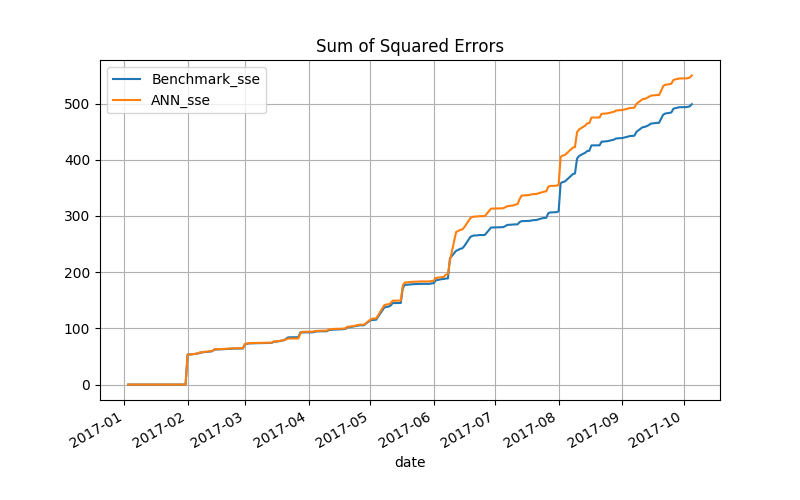

# Machine Learning Engineer Nanodegree
## Capstone Project
Tu Ha  
July 09th, 2018

## I. Definition

### Project Overview

Time series forecasting is required in a lot of domains as weather forecast, earthquake prediction, finance forecast, or population forecast. Forecasting tasks help us to foresee disasters, risks or chances emerging from nature, social, financial system, etc. A plan or action is then established to overcome or reduce damages or take advantage of the chances. Generally the more dynamics the time series has, the harder to predict its outcome. Stock price time series is known to have pretty high dynamics. Forecasting stock price, particularly Apple stock, is therefore chosen in this project because Apple is a big name and a market development representative.

A lot of researches have been made to find methodologies and techniques to understand the time series data, and improve prediction performance. While the traditional methodology analyzes dynamics of the time series, and often eliminate some complicated dynamics within the series before do forecasting, the AI-based methodology tries to build a model which learns the dynamics of the time series as much as possible. In this project the traditional methodology is selected to forecast financial time series.

The exponential smoothing method is applied to forecast Apple stock price (AAPL). The previous proposal suggested applying forecasting techniques on the stock return instead of the price because managers are usually interested in the profit rather than the actual price. However identifying a proper return period is another problem which requires knowledge from other domains. This project keeps the original dynamics of the time series and tries to build several models to forecast the daily price.

### Problem Statement

The financial time series always have high dynamics and contain random variables. Forecasting these time series is a difficult task. It is necessary to understand the behaviour of the series to predict the future outcome. Moreover how to exploit this understanding to predict the future outcome is really a challenge. The dual problem is to find a model which could both explain the behavior of the series basing on data in the past, and predict pretty well the future outcome. This is the general problem which is one of the subject studied in the machine learning domain.

There are generally two methodologies to tackle this problem. The traditional way is analyzing the dynamics of the time series, and modeling each component as much as possible. The morden way uses artificial intelligence architectures to mimic the original dynamics. It is hard to say which methodology is dominant, and this project tries to apply the traditional methodology. 

The dynamics of the Apple stock's history price dataset in several quarters will be decomposed into trend, season, and error components. This analysis is reasonable because the stock price has the trend and seasonal structures. The analysis result provides clues to the intrinsic properties of the time series, which are helpful to build up a forecasting model by the exponential smoothing method. This modeling method results in various Error-Trend-Season (ETS) models which are supposed to be able to capture the hidden properties of the dataset. The model parameters are then tweaked to explain these dynamics components as much as possible. The ETS models together with their optimal parameters which forecast the future prices closest to most of the actual ones are the best models we are looking for.

### Metrics

There are several metrics to measure how well a model forecasts the future outcome, e.g. sum of squared errors (SSE), root mean squared error, mean absolute error, or mean absolute percentage error. SSE is calculated by the formula

$$ SSE = \sum_{i=1}^{T} (observation_t - prediction_t)^2 $$
in which $T$ is the current prediction period.

SSE is mostly used in many researches because the metric tends to degrade models which have large errors spontaneously. A model with similar errors sequence is generally prefered to the one whose errors are quite different in magnitude. The large difference of the predicted price compared to the actual one ususally brings in huge risks. SSE metric will magnify these abnormal errors and makes the total squared error become very large. 

In addition to that, the forecasting ETS models in this project happenly explain a dataset most when the sum of squared errors is minimal. If parameters of a model are somehow optimized so that the model adapts most to the dataset, the metric becomes the indicator of the capability of the model. This provides a tool to select which ETS models are best for the AAPL time series in a specific period of time. The SSE metric is therefore used in this project to look for optimal parameters, and evaluate performance of models.

Another metric is used in this project to measure the similarity between two curves. The following figures present the idea about the similarity. The drift between similar curves is very small in the right one, and the shapes of two curves are also quite the same. The two curves are shifted in parts by several offsets only. The left figure shows the non-similarity where drift is present clearly.

Non-similar curves                                |  Similar curves
:------------------------------------------------:|:---------------------------------------------------:
  |  

The similarity can be calculated by the difference between the gradients of the two curves. The smaller the value, the more similar they are. Because this metric is applied to measure the similarity of two SSE curves, the gradient is the squared error at each prediction period. Similarity is then defined as the Sum of all Errors between the two Squared Errors of two curves.

$$ SESE = \sum_{i=1}^{T} (observation_t^a - prediction_t^a)^2 - (observation_t^b - prediction_t^b)^2 $$

where $observation_t^a$ is the observation of the curve $a$ at the period $t$.

## II. Analysis

### Data Exploration

The Apple stock price is provided by several platforms in Internet. This project retrieves the dataset in three years 2015, 2016 and 2017 from the Quandl platform (https://www.quandl.com/), and put them in the file AAPL_2015_2016_2017.csv. The python library *quandl* is a convenient tool to interact with this platform.

```python
import quandl
data = quandl.get_table('WIKI/PRICES', ticker = ['AAPL'], 
                        qopts = { 'columns': ['ticker', 'date', 'adj_close'] }, 
                        date = { 'gte': '2015-1-1', 'lte': '2017-12-31' }, 
```

The dynamics of Apple stock's adjusted close price in the first six months and two years 2015 and 2016 are ploted below.

| Apple stock price in 6 months                    |
|:------------------------------------------------:|
|                      |


| Apple stock price in 2 years                     |
|:------------------------------------------------:|
|                       |


The plots show that the price variable is nonstationary, and there is no abnormality in the whole dataset.

The trend and season properties of the dataset could be obtained by ETS decomposition. The plots below show the trend and seasonal features of the dataset in the year 2015. The *Observed* plot is the original stock price. The *Trend* plot is the averages of periods of 61 days (around three business months), which fluctuates through the year 2015. The *Seasonal* plot shows several seasonal patterns. The complication of the patterns depends much on the size of the analysing window. This implies the structure of the models forecasting this time series should depend on the window size parameter.

| ETS decomposition                                |
|:------------------------------------------------:|
|                    |


Stock price time series frequently has autocorrelation property. The figure below confirms the high autocorrelation within the APPL dataset in the year 2015.

| Autocorrelation within APPL in year 2015         |
|:------------------------------------------------:|
|                      |

### Algorithms and Techniques
#### i. ETS models
The exponential smoothing method (https://www.otexts.org/fpp/7) is applied to build up forecasting models in this project. The method takes the average of past observations, but prefers the recent measurements than the older ones. The preference is realized by putting the weights on each measurement, and decreasing the weights on the farther values exponentially. Hence the older the measurements, the less important those values. The predicted outcome $\hat{y}_{t+1|t}$ is the smoothing result of the present $y_{t}$ and past observations $y_{t-i}$.

$$ \hat{y}_{t+1|t} = \alpha y_{t}  + \alpha (1 - \alpha) y_{t-1}  + \alpha (1 - \alpha)^2 y_{t-2} + ... $$

Coefficient $\alpha$ represents how much the past observations would contribute to the predicted outcome. The smaller the $\alpha$, the more past observations present in the outcome. If $\alpha = 1$, the estimator become the naive prediction model. This formula can be rewritten in the recursive form.
$$
\begin{align}
\hat{y}_{t+1|t} &=  l_t \\ 
l_t &= l_{t-1}  + \alpha (y_t - l_{t-1}) \\
l_t &= l_{t-1}  + \alpha e_t
\end{align}
$$

The outcome of the above simple model is called the level because there is no further analysis on the dynamics of the time series. If the clue about the hidden properties of the dataset is concerned, dynamics components like the trend and the season could be taken into account. The predicted outcome is then the combination of the smoothed level, trend and season components. Pegels, Gardner and Taylor classified the combinations of the trend and season components into 15 TS models (https://www.otexts.org/fpp/7/6). The error component is usually integrated to these TS models in the additive or multiplicative forms. As a consequence, there are 30 ETS models in total, but choosing a suitable model is not trivial. Here is the AAA model in which the dynamics of trend, season, and error components are smoothed and added together to predict one-step ahead.

$$
\begin{align}
y_t &=  l_{t-1} + b_{t-1} + s_{t-m} + e_t \\ 
l_t &= l_{t-1} + b_{t-1}  + \alpha e_t \\
b_t &= b_{t-1}  + \beta e_t  \\
s_t &= s_{t-m} + \gamma e_t
\end{align}
$$

Several experiments on the AAPL time series in the year 2015 shows that ETS models with damping structure do not help to improve the prediction performance. The remaining 18 ETS models (ANN, AAN, AMN, MNN, MAN, MMN, ANA, ANM, AAA, AAM, AMA, AMM, MNA, MNM, MAA, MAM, MMA, MMM) are implemented and compared together in this project.

#### ii. The goal of optimizing ETS models
The performance of the forecasting models depends much on the initial conditions consisting of initial state, and model parameters. The maximum likelihood estimation technique is used to establish the objective equation to help finding the optimal initial condition. The book "Forecasting with exponential smoothing" by Rob J. Hyndman, Anne B. Koehler, J. Keith Ord and Ralph D. Snyder has proved that the optimal estimation is equivalent to minimizing the sum of squared errors. This implies there is no deterministic formula to calculate the optimal values. Heuristics and exhaustive searching technique are used as optimizers instead. Particularly the initial state ($l_0, b_0, s_0$) will be identified by heuristics, and optimal parameters ($\alpha, \beta, \gamma, m$) are estimated by exhaustive searching.

Plenty of experiments on ETS models have been performed with various initial states and parameter in this project, but the prediction performance of ETS models are always worser than the benchmark. Although this cannot make conclusion that ETS models' capability is less than the benchmark, approaching the benchmark's performance becomes the target in this project. Hence the goal of parameter optimization in this project is to bring the performance curve of the ETS models close to the benchmark's curve.


#### iii. Local model optimization approach vs the general training-testing-validation procedure
Training is actually the process of optimizing model parameters to reach some performance. The two terms *training* and *optimizing* are interchangeable in this project.

The forecasting algorithm follows the general framework of the local modeling approach. The models are trained with a fixed-length window of the time series before do prediction one-step ahead. The window is then shifted forward one step, and the procedure of training-predicting starts again. The disadvantage of local modeling approach is the difficulty in estimating the window size. If the size is too short, the model may not learn enough to predict the next outcome. If the size is too large, the model might learn so much that it would be stuck to the history behavior of the time series, and cannot predict the future outcome. Estimating a proper window size is a nontrivial problem because the optimal size can be vary depending on the local dynamics. The window size is assumed to be fixed in this project, and another optimization process is needed to estimate the window size. 

There are key differences between the local modeling and global modeling methods in the way of estimating optimal parameters. The global approach looks for optimal parameters by the training-testing procedure. This estimation process occurs only once, and the model is then deployed to do forecasting on the whole validation dataset. On the contrary, local models always depend on the window size parameter whose estimation process is seperated from the optimization process of the model parameters. After a suitable window size is identified, the other parameters are optimized with the data segment in the window only. 

##### *Window size vs training-testing*
Because the window size is estimated once and used to estimate other parameters on the whole dataset, this estimation procedure is similar to the training-testing procedure in the global approach. The window size is often very small compared to the whole dataset. The testing phase, therefore, could be replaced by multiple training phases on different sub-datasets, and the best estimate could be taken out by some voting mechanism. 

The purpose of window size optimization is to find a suitable length of data segments with which ETS models are supposed to be able to learn enough to predict the outcome one-step ahead. Prediction of ETS models should then be close to the time series. However many experiments show that the prediction performance of ETS models is not better than the benchmark. We therefore look for parameters which help ETS models imitate the behavior of the benchmark. The more similar the behavior, the more similar the SSE curves of ETS models to that of the benchmark model.

Metric SESE is used to measure the similarity, and measurements are performed on five sub-datasets. ETS models are trained on each sub-dataset with a list of predefined window sizes (2,10,18,20,25). One SESE curve is obtained for each training sub-dataset. Each curve has five SESE measurement for five predefined points. Generally the larger the window size, the smaller the SESE measurement, but much more computational time. The optimal size is therefore chosen to be the smallest one on the five SESE curves at which SESE performance is not improved much. Experiments show that at the optimal point, at least two curves have a trend of increasing SESE. This helps to implement the early stopping mechanism in optimizing the window size.

Optimal window size location                      |  Optimal window size location with early stopping mechanism
:------------------------------------------------:|:---------------------------------------------------:
     |  

Optimal window size is 25 in the left figure. The green, purple, red and orange curves tend to increase at the point 18. The early stopping mechanism helps to discover the optimal size of 18 in the right figure, and save a lot of computation. Window size optimization should be performed for each model though most of optimal sizes take the value of 18.

##### *Model parameters vs validation*
The second model training is to estimate its own parameters ($\alpha, \beta, \gamma, m$). While the above training-testing procedure tries to identify how much capicity to learn an ETS model should take, the second traning phase helps local models explain as much as possible the data in each window. This well-trained model is used to predict one-step ahead beyond the training window. The window is then moved one step forward and the model is trained again before doing prediction further one-step ahead. The training in this phase is the essential part of the prediction action of the model, which is the key difference between the local and global modeling. Hence the model training belongs to the general validation phase without testing action.

Data in a window is explained most if the sum of squared errors is minimal, but there is no formula or constrain equation to calculate parameters so that SSE is minimal. The exhaustive searching technique is therefore implemented, and four general heuristics are used $0 \le \alpha \le 1$, $0 \le \beta \le \alpha$, $0 \le \gamma \le 1-\alpha$ and $1 \le m \le 12$. A model will be trained over the window many times, and the SSE value coresponding to each tuple of parameters is calculated in each training procedure. At the end of the training phase, the tuple with lowest SSE is the optimal estimate.

#### iv. Confidence interval
Single predicted outcome hardly matches the actual outcome of the time series. It is much more helpful if a confidence interval is provided together with the single outcome. The formula and the simulation method to calculate the confidence interval can also be found in the book "Forecasting with exponential smoothing". Confidence intervals are also implemented in this project.

### Benchmark
The benchmark model is the naive forecasting model which predicts tomorrow price equal to today price. Therefore the forecasting result is simply the shift of the dataset one step into the future.

If there were a model which always predicts correctly tomorrow price, the predicted series and the actual time series would match together perfectly. In other words, the normalized cross correlation between the two series would be one. Unfortunately there is no perfect model discovered until now. The best forecasting model would be supposed to have the highest cross correlation value but not one. The above figure about the autocorrelation of AAPL shows that the time series with lag length of one has the heighest correlation score. This means the naive forecasting model produces a time series which is considered to be quite similar to the actual time series. It is reasonable to chose the naive model to be the benchmark model.

## III. Methodology

### Data Preprocessing
There is no data preprocessing step in this project because the original time series (adjusted close price) is used instead of stock return. The 3-year dataset contains 753 trading days, and is divided into six sub-datasets for the training-testing and validation phases.

| Day index | Length [days]  |  Phase     |  Purpose                  |
|:---------:|:--------------:|:-----------|:--------------------------|
| 0         | 63             | training   | optimize window size      |
| 63        | 63             | training   | optimize window size      |
| 126       | 63             | training   | optimize window size      |
| 189       | 63             | training   | optimize window size      |
| 252       | 63             | training   | optimize window size      |
| 504       | 191            | validation | optimize model parameters |

### Implementation
This session represents how the ETS models are exploited for the forecasting task. Each model is implemented by a class, but its implementation is not discussed because they are just the coding of the available formula (https://www.otexts.org/fpp/7/7).

There are four main parts in the implementation: training, validation, optimizing model parameters, and forecasting. The models applied for the forecasting task are listed in the dictionary *model_ets*. The training and validation parts are implemented in the main file *forecast.py*. The model parameter optimization and forecasting parts are implemented as the class *local_modeling* in the file *local_modeling.py*. A dataframe is generated in the class *local_modeling* to contain the estimated parameters, prediction results, and the performance of all models during the training and validation phases.

```python
#######################################################################################
# master parameters for the local modeling framework
#day_len = 504 # first 2 years
#day_len = 252 # first one year
#day_len = 191 # first nine months
#day_len = 122 # first six months
#day_len = 61 # first three months
#day_len = 40 # first two months
#day_len = 20 # first month

# 5 datasets to estimate the suitable window size in the training-testing phase
day_start   = [0,63,126,189,252]
day_len     = 63

# dataset to do forecasting in the validation phase
validate_day_start = 504
validate_day_len   = 191

# hope the suitable window size is one of the following lengths
segment_len = [2,10,18,20,25]

# Models declaration, all models which may be used in the program are listed here
model_bmk = {'Benchmark':('BMK',benchmark)}

# all ETS models
model_ets = {'ANN':{'type':'ETS','class':ets_ANN,'seglen':segment_len},
             'ANA':{'type':'ETS','class':ets_ANA,'seglen':segment_len},
             'ANM':{'type':'ETS','class':ets_ANM,'seglen':segment_len},
             'AAN':{'type':'ETS','class':ets_AAN,'seglen':segment_len},
             'AAA':{'type':'ETS','class':ets_AAA,'seglen':segment_len},
             'AAM':{'type':'ETS','class':ets_AAM,'seglen':segment_len},
             'AMN':{'type':'ETS','class':ets_AMN,'seglen':segment_len},
             'AMA':{'type':'ETS','class':ets_AMA,'seglen':segment_len},
             'AMM':{'type':'ETS','class':ets_AMM,'seglen':segment_len},
             'MNN':{'type':'ETS','class':ets_MNN,'seglen':segment_len},
             'MNA':{'type':'ETS','class':ets_MNA,'seglen':segment_len},
             'MNM':{'type':'ETS','class':ets_MNM,'seglen':segment_len},
             'MAN':{'type':'ETS','class':ets_MAN,'seglen':segment_len},
             'MAA':{'type':'ETS','class':ets_MAA,'seglen':segment_len},
             'MAM':{'type':'ETS','class':ets_MAM,'seglen':segment_len},
             'MMN':{'type':'ETS','class':ets_MMN,'seglen':segment_len},
             'MMA':{'type':'ETS','class':ets_MMA,'seglen':segment_len},
             'MMM':{'type':'ETS','class':ets_MMM,'seglen':segment_len}}
```

#### i. Initial state and model parameter optimization
Function **optimize()** returns the initial state by heuristics and model parameters by exhaustive search technique. Experiments show that several ETS models have similar performance when they share the same perticular initial state, and this performance is better than the case of using random initial state. There are three groups of initial state.
```python
#group1: (l0=y[0], b0=1, s0=1) # y[0] is the first element in the local dataset
#group2: (l0=y[0], b0=1, s0=0)
#group3: (l0=y[0], b0=0, s0=1)

model_ets_group1 = ['ANN','ANM','AAdN','AMN','AMA','AMM','MNN','MNM','MMN','MMA','MMM']
model_ets_group2 = ['ANA','AAN','AAA','MNA','MAN','MAA']
model_ets_group3 = ['AAM','MAM']
```
These initial states are used as the starting point to optimize the models parameters ($\alpha, \beta, \gamma, m, \phi$). The $\alpha$ parameter takes values in the range [0,1] with step size 0.1. $\beta$ takes values in the range $[0,\alpha]$ with step size 0.01. $\gamma$ takes values in the range $[0,1-\alpha]$ with step size 0.01. $m$ takes values in the range [1,12]. $\phi$ takes values in range [0,1] with step size 0.01, but $\phi$ is not used in this project because we do not use the damping structure in ETS models. The parameter space reduces to four dimensions, and a looping with depth of four is implemented. Therefore the **optimize()** function becomes the bottle net of the whole program.

With each and every points in the parameter space, a new ETS model is created and does regression over the data segment whose size is equal to the estimated window size. The sum of squared errors (SSE) is calculated all over the regression. The optimal parameter tuple is the one which has minimum SSE. Below is a typical optimizer for ETS models with parameters $\alpha, \beta, \gamma, m$
```python
##############################################################################
# optimizer for alpha, beta, gamma & m parameters
def optimizer_ets_abg(y, ets_model, state0, m):
    '''
    y         : the dataset w/o time index
    ets_model : ETS model to be optimized.
    state0    : the initial state to begin optimization
    m         : the period of the seasonality, m=4 for quarterly, 12 for monthly,
                if m=0, optimizing m is required.
    '''
    sse = float("inf")
    for a in np.arange(0.0, ALPHA+0.1, 0.1): # 0 <= alpha <= 1
        for b in np.arange(0.0, a+0.01, 0.01): # 0 <= beta <= alpha
            for g in np.arange(0.0, (ALPHA-a)+0.01, 0.01): # 0 <= gamma <= ALPHA-alpha
                if (m==0): # optimizing m is required
                    for mm in range(1,13,1): #  1<= mm <= 12
                        para = (a,b,g,mm,0) # alpha, beta, gamma, m, phi
                        ets = ets_model(state0=state0, parameters=para)
                        for i in range(1,len(y)):
                            ets.predict_observe(y[i])

                        # store performance coressponding to the alpha n beta
                        if (ets.sse < sse):
                            sse = ets.sse
                            alpha = a
                            beta  = b
                            gamma = g
                            season = mm

                else: # use m input to optimize there other parameters.
                    para = (a,b,g,m,0) # alpha, beta, gamma, m, phi
                    ets = ets_model(state0=state0, parameters=para)
                    for i in range(1,len(y)):
                        ets.predict_observe(y[i])

                    # store performance coressponding to the alpha n beta
                    if (ets.sse < sse):
                        sse = ets.sse
                        alpha = a
                        beta  = b
                        gamma = g
                        season = m

          # alpha, beta, gamma,      m, phi
    return (alpha, beta, gamma, season,   0) 
```

#### ii. Forecasting
After optimal parameters and suitable window size are estimated, an optimized ETS model is created and does regression over the whole data segment. The final regression step is the prediction one-step ahead. The confidence interval is estimated by the model as well.

```python
def predict(y, model_list, state0, parameters, conf_interval=0.683):
    '''
    y         : dataset w/o time index for forecasting
    model_list: the list of models to do forecasting
    state0    : the list of initial states of the models
    parameters: the list of initial parameters of the models
    conf_interval : confident interval to get prediction intervals
    '''

    prediction = {} # The prediction of the first period of the time series should be NaN.

    for name,(_,model) in model_list.iteritems():
        # Create model with initial condition.
        mdl = model(state0[name], parameters[name], conf_interval=conf_interval)

        # Autoregression process to reach the latest period t
        for i in range(1,len(y)): 
            mdl.predict_observe(y[i])

        # Do forecasting for the future period t+1
        y_hat = mdl.predict()
        (y_lower, y_upper) = mdl.pred_interval
        prediction[name] = (y_hat, y_lower, y_upper)

    return prediction
```

#### iii. Training
Window size for each model in the list *model_ets* is estimated in the training phase. The model is trained on five sub-datasets to get five SESE curves. Five predefined window sizes are tried in each sub-dataset. The optimal size is the smallest value whose SESE's cannot be reduced much. The early stoping mechanism is implemented to detect the optimal size early. Output of the training phase is the smallest optimal size and a larger 'non-optimal' size. Both estimates will be used in the validation phase to compare performance of the model in two cases.

```python
################################### Training phase ####################################
# Purpose of this phase: choose the most suitable window size (segment length) for each model

# Placeholder to store outputs of the training phase, ie. the sese performances
train_sese   = {} # the sese values, for ploting only.
cutting_slen = {} # the segment length at the cutting points of all models,
n_curves = 2      # cutting point where at least 2 out of 5 SESE curves have tendency to increase

for name,info in model_ets.iteritems():
    mdl = dict(model_bmk)
    mdl.update({name:(info['type'],info['class'])})
    slen_list = info['seglen']
    train_sese[name] = {} 
    # all points on the SESE curves have zero probability to be the cutting point.
    cutting_prob       = [0 for i in range(len(slen_list))]
    cutting_slen[name] = {}      # each model may have different cutting point.
    stop               = False   # implement the early stoping in training process

    print("= Train on multiple datasets =")
    dataset_idx = 0
    while (dataset_idx < len(day_start) and stop == False):
        train_sese[name][dataset_idx] = np.array([None for i in range(len(segment_len))])
        prev_sese = float("inf")

        print("--Train on multiple window sizes--")
        slen_idx = 0
        while (slen_idx < len(slen_list) and stop == False):
            # Run model with the training dataset and predefined segment length
            train_modeling = local_modeling('train', mdl, price, ts, day_start[dataset_idx],\
                                            day_len, slen_list[slen_idx])
            train_modeling.optimize_predict(confd[CI])

            # Dump everything to files
            train_modeling.write_to_file()
            train_modeling.plot_to_file(CI)

            # Get SESE performance to evaluate the training process
            sese = train_modeling.get_sese()[name]
            train_sese[name][dataset_idx][slen_idx] = sese

            # early stoping the training process
            cutting_slen[name]['nonOptimal'] = slen_list[slen_idx]
            cutting_slen[name]['Optimal']    = slen_list[slen_idx]
            if sese >= prev_sese:
                # the previous performance may be the cutting point
                cutting_prob[slen_idx-1] += 1
                if cutting_prob[slen_idx-1] >= n_curves:
                    stop = True # stop the whole training process for this model
                    cutting_slen[name]['Optimal'] = slen_list[slen_idx-1]
            prev_sese = sese

            slen_idx += 1
        dataset_idx += 1
```

The local model generated on each training dataset with a predefined window size is optimized to adapt most to the data in the window, and makes prediction one-step ahead. The window is then shifted one step forward within the training dataset. The optimizing-predicting process repeats on the new window. The SSE and SESE values are calculated over the whole dataset. This procedure is implemented in the function *optimize_predict()*

```python
def optimize_predict(self, confidence_interval):
    while (not self.series.empty):
        # 1. Optimize initial state by heuristics
        #    Optimize parameters by exhaustive searching technique
        #    m=0 to optimize m parameter as well.
        #    Optimal m is usually equal to 1 for most of the models, 
        #    could put m=1 to by pass optimizing m (reduce run time much)
        state0, opPara = optimize(self.y, self.model_list, m=0)

        # 2. Do prediction
        prediction = predict(self.y, self.model_list, state0=state0, parameters=opPara, \
                             conf_interval=confidence_interval)

        # a. Store prediction results and the optimal parameters
        outcome = {} # all outcomes in one prediction period, ie. one row in the dataframe

        for name in list(prediction.keys()):
            outcome[name]          = prediction[name][0] # y_hat
            outcome[name+'_lower'] = prediction[name][1] # interval
            outcome[name+'_upper'] = prediction[name][2] # interval

        for name in list(self.model_list.keys()):
            if (name is not "Benchmark"):
                outcome[name+'_alpha'] = opPara[name][0]
                outcome[name+'_beta']  = opPara[name][1]
                outcome[name+'_gamma'] = opPara[name][2]
                outcome[name+'_m']     = opPara[name][3]

        # b. Get the next segment for the next prediction period
        self.series = self.ts.get_next_segment()

        # 3. Measure performances sqe & sse until current period
        if (not self.series.empty):
           self.y = np.squeeze(self.series.values)
           y_observed = self.y[len(self.y)-1]
           outcome[self.ts_name] = y_observed

           for name in list(prediction.keys()):
               y_hat = prediction[name][0]
               error = y_observed - y_hat
               sse   = self.df[name+'_sse'][len(self.df)-1] # latest sse
               outcome[name+'_sqe'] = error**2
               outcome[name+'_sse'] = sse + error**2
               outcome[name+'_acf'] = error # to check autocorrelation

        # c. Append the outcome to dataframe
        if (not self.series.empty): # time index for tomorrow is available
            tomorrow = self.series.index[len(self.series)-1] 
        else: # no time index for tomorrow, assuming tomorrow is the next day
            today = self.df.index[len(self.df)-1]
            tomorrow = today + datetime.timedelta(days=1)

        row = pd.DataFrame([outcome])    
        row.reset_index(inplace=False)
        row['date'] = tomorrow
        row = row.set_index('date')
        self.df = self.df.append(row, sort=True)

    # End of prediction, calculate SESE
    self.sese = {} # store SESE values of all models
    for name in list(self.model_list.keys()):
        self.df[name+'_ese'] = self.df[name+'_sqe'] - self.df['Benchmark'+'_sqe']
        self.sese[name] = self.df[name+'_ese'].sum()
```

#### iv. Validation
Validation procedure is similar to the training phase. The optimizing-predicting process occurs on one larger dataset with two windows, the optimal one and a larger one. Two SSE curves are calculated over the whole validation dataset to compare the performance of the model. The SSE performances should be almost the same in these two cases.

```python
################################## Validation phase ###################################
# Placeholders to get back performances of each model
optimal_sese    = {}
optimal_sse     = {}
nonOptimal_sese = {}
nonOptimal_sse  = {}

# get the models to be validated together with their suitable window sizes
for name,info in model_ets.iteritems():
    mdl = dict(model_bmk)
    mdl.update({name:(info['type'],info['class'])})

    # compare the model performances in two cases to evaluate the hypothesis
    # about the optimal segment length.
    optimal_seglen    = cutting_slen[name]['Optimal']
    nonOptimal_seglen = cutting_slen[name]['nonOptimal']

    ################################################
    # Run the model with optimal segment length
    print("validate_optimal {}".format(name))
    validate_modeling = local_modeling('validate_optimal', mdl, price, ts, validate_day_start,\
                                        validate_day_len, optimal_seglen)
    validate_modeling.optimize_predict(confd[CI])

    # dump everything to files
    validate_modeling.write_to_file()
    validate_modeling.plot_to_file(CI)

    # Get sese & sse performance
    optimal_sese[name] = validate_modeling.get_sese()[name]
    optimal_sse[name]  = validate_modeling.get_sse()[name]


    ################################################
    # Run the model with non-optimal segment length
    if(nonOptimal_seglen != optimal_seglen):
        print("validate_nonoptimal {}".format(name))
        validate_modeling = local_modeling('validate_nonoptimal', mdl, price, ts, validate_day_start,\
                                            validate_day_len, nonOptimal_seglen)
        validate_modeling.optimize_predict(confd[CI])

        # dump everything to files
        validate_modeling.write_to_file()
        validate_modeling.plot_to_file(CI)

        # Get sese & sse performance
        nonOptimal_sese[name] = validate_modeling.get_sese()[name]
        nonOptimal_sse[name]  = validate_modeling.get_sse()[name]
```

### Refinement
The above implementation separates the implementation of forecasting models from the general forecasting framework using local modeling approach. This architecture allows new models to be developed seperatedly and performance of multiple models could be compared in one run. However the ETS models require model parameters to be optimized to archieve the best performance, and the exhaustive searching technique is used for the optimization process. The computational cost for the optimal parameters becomes extremely large in each prediction period. The original three-year time series is therefore not used up, only the year 2015 and the first nine month of the year 2017 is used in order to reduce the running time. Data in the year 2015 is used for the training and the other for validation.

## IV. Results

### Model Evaluation and Validation
#### i. Effect of Window size
The plots of performance and experiment outputs could be found in the folder *output*. The SESE graphs in the training phase show that the behavior of ETS models with the optimal window sizes is not different much from the cases of larger window sizes. Below is the representative plot of the AAN model.

| SESE Performance of AAN model with various window sizes           |
|:-----------------------------------------------------------------:|
| |

However The experiments on the validation dataset shows the opposite result. The representative plots below show that the larger the window size, the SSE performance curves of the optimal ETS models tend to get closer (SESE much smaller) to those of the benchmark model. If the window extends so much to the past, the optimal ETS models would become the predictor on the global scale, and have the same behavior as the benchmark model. However this does not neccesary mean the capability of ETS models is less than the benchmark model because the performance also depends on the initial condition. The heuristics used in this project might be some how not suitable for the ETS models to forecast the AAPL time series.

| SSE Performance of AAN model with window size of 18, SESE = 131                              |
|:--------------------------------------------------------------------------------------------:|
| |

| SSE Performance of AAN model with window size of 20, SESE = 91                                     |
|:--------------------------------------------------------------------------------------------------:|
| |


The following statistics table shows how much some models could take with a little bit larger window size on the validation dataset.

| Dataset    | ETS models | Window size         | SESE value | Delta SESE | Improvement percentage |
|:----------:|:----------:|:-------------------:|:----------:|:----------:|:----------------------:|
| Validation | ANN        | 18                  | 68         |            |                        |
|            |            | 20                  | 51         | -17        | 25%                    |
| Validation | ANA        | 18                  | 71         |            |                        |
|            |            | 20                  | 48         | -23        | 32%                    |
| Validation | ANM        | 18                  | 71         |            |                        |
|            |            | 20                  | 48         | -23        | 32%                    |
| Validation | AAN        | 18                  | 131        |            |                        |
|            |            | 20                  | 91         | -40        | 30%                    |
| Validation | AMN        | 20                  | 170        |            |                        |
|            |            | 25                  | 55         | -115       | 67%                    |
| Validation | MNN        | 18                  | 68         |            |                        |
|            |            | 20                  | 51         | -17        | 25%                    |
| Validation | MAN        | 18                  | 131        |            |                        |
|            |            | 20                  | 91         | -40        | 30%                    |
| Validation | MMN        | 20                  | 170        |            |                        |
|            |            | 25                  | 55         | -115       | 67%                    |

The improvement percentage is significant in almost all cases. This implies the window size estimate is not suitable. Parmeter tunning in the training phase is necessary. For example, there should be at least 4 out of 5 curves (n_curves = 4) have tendency of increasing SESE at the cutting point. The lengths of training datasets are currently three months, they should be extended to identify the cutting points more precisely.

In conclusion, the window size has a strong impact on the prediction performance of local models. The above statistics may change on another validation dataset. Other experiments are vital to improve the training phase to estimate the window size more precisely.


#### ii. Compare models
On the same condition, ie. the same datasets and window size, the model **ANN** always has smallest SESE in all ETS models. It is interesting to know that the ANN model is also the simplest ETS model, which has no trend and season components of dynamics. The dynamics equation of ANN model consists of the level only.
$$
\begin{align}
y_t &=  l_{t-1} + e_t \\ 
l_t &= l_{t-1}  + \alpha e_t \\
\end{align}
$$

If $\alpha=1$, the ANN model becomes the benchmark model. The dynamics figure of $\alpha$ parameter shows that although $\alpha$ often takes value of 1, the prediction operations of ANN model is different from the benchmark model.

| dynamics of $\alpha$ of AAN model with window size of 20                                            |
|:---------------------------------------------------------------------------------------------------:|
| |

The SSE curve of ANN model is closest to the benchmark model. This means ANN model imitakes almost perfectly the prediction behavior of the benchmark model by its own way.

| SSE curve of ANN model with window size of 20                                                       |
|:---------------------------------------------------------------------------------------------------:|
|  |

The forecasting curve of ANN model almost matches the benchmark.

| Forecasting curve of ANN model with window size of 20                                                   |
|:--------------------------------------------------------------------------------------------------------:|
|  |

| 3-sigma Confidence Interval of ANN model with window size of 20                                          |
|:--------------------------------------------------------------------------------------------------------:|
|  |

The 3-sigman confidence interval covers almost all the dataset. Several exceptions occur at the high or deep cliffs. Two exceptions could be seen vividly is at the time slice 2017-08 and the deep cliff between 2017-06 and 2017-07. The AAPL price curve acrosses the confidence interval, and the SSE curve jumps up significantly. These two exceptional cases generate SESE pulses to lift up the SSE curve. The shape of SSE curve is same as that of the benchmark for the rest of the dataset. This implies that the ANN model is very robust as well. It can recover from high pitch disturbance.

## V. Conclusion

The intrinsic properties of autocorrelation and nonstationary of AAPL time series are the challenges for every forecasting models in general, and ETS models as well. The figure of AAPL autocorrelations in the year 2015 in the data exploration section reveals the very high autocorrelation in the one-step ahead prediction with the present price. Unfortunately all ETS models do not capture this property of the time series. This makes the autoregression structure of the ETS models confused, and cannot explain enough the local dataset to make proper prediction.

The naive model is assumed to be the best model for the AAPL time serires basing on the autocorrelation metric. The fact that the best ANN model successfully imitates the behavior of the benchmark model by its own dynamics except the points at high and deep cliffs is remarkable. The stable SSE curve compared to that of the benchmark also proves the robustness of the model. 

This behavior of ANN model does not occasionally occur on specific time series. A number of experiments with the model on various time series and the window size shows that dynamics of $\alpha$ depends much on the windows size. The smaller the window (less than 20), the more dynamics the parameter $\alpha$ has. And the larger the window (larger than 30), the less dynamics the parameter has and more frequently takes the value of 1. This means ANN model shifts closer to the benchmark model when the window is large, and singular to the benchmark when the window gets very large. In other words, ANN model is the general case of the naive model. Moreover the model has the same framework with other ETS models. This makes ANN the special model. It would be easier to compare and analyze performance of an ETS model with another ETS model, ANN in this case. The analysis result is then reviewed with very large window sizes to compare with the naive model.

### Reflection

The forecasting problem requires knowedge from a lot of domains to solve it. This project eliminates all financial knowledge about the stock price, and tries to tackle the problem purely by machine learning techniques. The local modeling approach is used to build up the forecasting models. There are a lot of modeling methods, two methods have been studied in the proposal. James McNames uses the nearest neighbor technique and Takens' theorem to build the model. The second method comes from the exponential smoothing technique, and is modified to take into account other dynamics components. The statistics framework behind the later method provides the confidence interval of the point prediction. This is more informative than just the point prediction. Therefore the ETS models are used in this project.

The project has underestimated the influence of the autocorrelation property of the time series on modeling. It is interesting to know how badly the autocorrelation impacts on the autogression models through the experiments in this project. Another interesting thing is the estimation of the window size. We found out the minimum length that helps the ETS models to be able to minic the behavior of the benchmark model.

The most difficult aspect of the project is how to estimate the optimal initial condition and the window size. The current exhaustive searching technique may help but increases dramatically the computational cost.

The solution of using ETS models with the original time series input could be considered to solve the problem from the statiscal point of view. The 3-sigma confidence interval of ANN model covers almost all the validation time series.


### Improvement

The initial condition is the bottle net of the algorithm. Another method to estimate the initial state and optimal parameters is the highest priority.

The prediction performance could be improved if autocorrelation in the time series is eliminated. The first derivative helps to remove the one-lag autocorrelation.

The nonstationary property of the time series also influences the performance. Filtering technique could reduce the dynamics of the dataset and impove the prediction performance much.

The performance of forecasting models can also be evaluated by looking at the sequence of residuals. This is not a metric but a trick to improve the performance of the models. A certain pattern in the residuals sequence means there should be a bias in the models.

The prediction step does actually repeat one of the case of model parameter optimization step. The best result in the optimization procedure could be used as the prediction outcome.

The performance evaluation of the six ETS models comes from the implementation in this project. Experiments using other implementations of ETS models to forecast the time series of Apple stock price is neccesary. If it is the fact that the ETS models are not able to provide better performance than the simple benchmark model, there should be a reason or theory behind this. It is worth conducting researches about this limitation.

The formula to estimate confidence intervals used in ETS models with multiplication strutures, e.g. MNN, MNA, MNM, etc., provides abnormally large intervals. Implementation of these formula in this project should be reviewed.

Applying artificial intelligence architectures to capture the original dynamics instead of just the error, trend and season dynamics is the current trend. However building a proper AI architecture for the problem is really a challenge as well.

-----------
